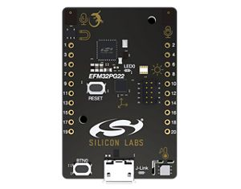

.. _efm32pg22_dk2503a:

EFM32PG22 Pearl Gecko Starter Kit
#############################

Overview
********

The EFM32PG22 Dev Kit EFM32PG22-DK2503A is a low cost, small form factor 
prototype and development platform for the EFM32PG22 microcontroller.

The board is a small and cost-effective, feature-rich, 
prototype and development platform based on the EFM32™ microcontroller.

The PG22 Dev Kit is an ideal platform for developing energy-friendly 
electronic devices.

A built-in SEGGER J-Link debugger ensures easy debugging through the 
USB Micro-B connector. 

Most of the EFM32PG22 I/Os are routed to breakout pads on the sides 
of the board making it easy to expand on the board and evaluate the 
EFM32PG22's features with custom hardware.

   EFM32PG22-DK2503A (image courtesy of Silicon Labs)

Hardware
********

 - Power control of on-board peripherals for ultra-low power operation
- Relative humidity and temperature sensor
- Ambient light sensor
- Hall effect sensor
- 6-axis inertial sensor
- PDM stereo microphones
- 8 Mbit serial flash
- User LED and push button
- 20-pin 2.54 mm breakout pads
- SEGGER J-Link on-board debugger
- Virtual COM port
- Mini Simplicity connector for AEM and virtual COM using external Silicon Labs debugger
- USB or coin cell battery powered

For more information about the EFM32PG SoC and EFM32PG22-DK2503A board:

- `EFM32PG Website`_
- `EFM32PG22 Datasheet`_
- `EFM32PG22 Reference Manual`_
- `PG22-DK2503A Website`_
- `PG22-DK2503A User Guide`_
- `PG22-DK2503A Schematics`_

Supported Features
==================

The efm32pg22_dk2503a board configuration supports the following hardware features:

+-----------+------------+-------------------------------------+
| Interface | Controller | Driver/Component                    |
+===========+============+=====================================+
| MPU       | on-chip    | memory protection unit              |
+-----------+------------+-------------------------------------+
| NVIC      | on-chip    | nested vector interrupt controller  |
+-----------+------------+-------------------------------------+
| SYSTICK   | on-chip    | systick                             |
+-----------+------------+-------------------------------------+
| COUNTER   | on-chip    | rtcc                                |
+-----------+------------+-------------------------------------+
| FLASH     | on-chip    | flash memory                        |
+-----------+------------+-------------------------------------+
| GPIO      | on-chip    | gpio                                |
+-----------+------------+-------------------------------------+
| UART      | on-chip    | serial port-polling;                |
|           |            | serial port-interrupt               |
+-----------+------------+-------------------------------------+
| I2C       | on-chip    | i2c port-polling                    |
+-----------+------------+-------------------------------------+
| WATCHDOG  | on-chip    | watchdog                            |
+-----------+------------+-------------------------------------+
| TRNG      | on-chip    | true random number generator        |
+-----------+------------+-------------------------------------+

The default configuration can be found in the defconfig file:

	``boards/arm/efm32pg22_dk2503a/efm32pg22_dk2503a_defconfig``

Other hardware features are currently not supported by the port.

Connections and IOs
===================

The EFM32PG22 SoC has four GPIO controllers (PORTA to PORTD) and
all are enabled for the EFM32PG22-DK2503A board.

In the following table, the column **Name** contains pin names. For example, PB2
means pin number 2 on PORTB, as used in the board's datasheets and manuals.

+-------+-------------+-------------------------------------+
| Name  | Function    | Usage                               |
+=======+=============+=====================================+
| PA4   | GPIO        | LED                                 |
+-------+-------------+-------------------------------------+
| PB3   | GPIO        | Push Button PB                      |
+-------+-------------+-------------------------------------+
| PA5   | UART_TX     | UART TX Console VCOM_TX US1_TX #0   |
+-------+-------------+-------------------------------------+
| PA6   | UART_RX     | UART RX Console VCOM_RX US1_RX #0   |
+-------+-------------+-------------------------------------+
| PD2   | I2C_SDA     | ENV_I2C_SDA I2C0_SDA #0             |
+-------+-------------+-------------------------------------+
| PD3   | I2C_SCL     | ENV_I2C_SCL I2C0_SCL #0             |
+-------+-------------+-------------------------------------+

System Clock
============

The EFM32PG22 SoC has a maximum 76.8 MHz operating frequency.

Serial Port
===========

The EFM32PG22 SoC has two USARTs and one Enhanced UART (EUART).

Programming and Debugging
*************************

.. note::
   Before using the kit the first time, you should update the J-Link firmware
   from `J-Link-Downloads`_

Flashing
========

The EFM32PG22-DK2503A includes an `J-Link`_ serial and debug adaptor built into the
board. The adaptor provides:

- A USB connection to the host computer, which exposes a mass storage device and a
  USB serial port.
- A serial flash device, which implements the USB flash disk file storage.
- A physical UART connection which is relayed over interface USB serial port.

Flashing an application to EFM32PG22-DK2503A
-------------------------------------------

The sample application :ref:`hello_world` is used for this example.
Build the Zephyr kernel and application:

.. zephyr-app-commands::
   :zephyr-app: samples/hello_world
   :board: efm32pg22_dk2503a
   :goals: build

Connect the EFM32PG22-DK2503A to your host computer using the USB port and you
should see a USB connection which exposes a mass storage device(DK2503A).
Copy the generated zephyr.bin to the DK2503A drive.

Use a USB-to-UART converter such as an FT232/CP2102 to connect to the UART on the
expansion header.

Open a serial terminal (minicom, putty, etc.) with the following settings:

- Speed: 115200
- Data: 8 bits
- Parity: None
- Stop bits: 1

Reset the board and you'll see the following message on the corresponding serial port
terminal session:

.. code-block:: console

   Hello World! arm

.. _EFM32PG22-DK2503A Website:
   https://www.silabs.com/development-tools/mcu/32-bit/efm32pg22-dev-kit

.. _EFM32PG22-DK2503A User Guide:
   https://www.silabs.com/documents/public/user-guides/ug474-pg22-dk2503a-user-guide.pdf

.. _EFM32PG22-DK2503A Schematics:
   https://silabs-prod.adobecqms.net/documents/public/schematic-files/BRD2503A-A01-schematic.pdf

.. _EFM32PG Website:
   https://www.silabs.com/mcu/32-bit-microcontrollers/efm32pg22-series-2

.. _EFM32PG22 Datasheet:
   https://www.silabs.com/documents/public/data-sheets/efm32pg22-datasheet.pdf

.. _EFM32PG22 Reference Manual:
   https://www.silabs.com/documents/public/reference-manuals/efm32pg22-rm.pdf

.. _J-Link:
   https://www.segger.com/jlink-debug-probes.html

.. _J-Link-Downloads:
   https://www.segger.com/downloads/jlink
